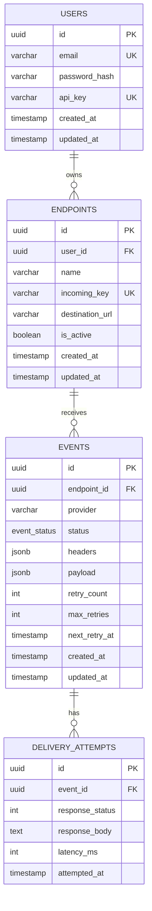
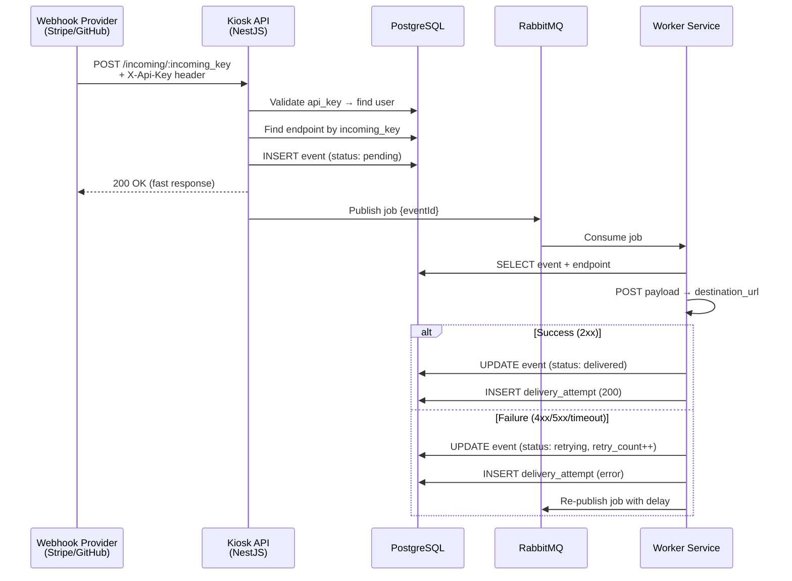

# Database Schema Plan — Kiosk Webhook Reliability Layer

Dokumen ini merancang schema PostgreSQL untuk backend Kiosk berdasarkan data model yang sudah tervalidasi di frontend (mockData, DataContext, AuthContext) dan spesifikasi arsitektur di [Ai_AGENT.md](file:///home/numpyh/Documents/github_project/kiosk/be/Ai_AGENT.md).

---

## Prinsip Desain

Schema ini didesain **use-case first** — dimulai dari pertanyaan yang harus dijawab dashboard:

| Pertanyaan Dashboard | Tabel yang Terlibat |
|---|---|
| Berapa total event, berapa yang delivered/retrying/dead? | `events` (aggregate by status) |
| Endpoint mana yang paling sering gagal? | `events` → `endpoints` (join + aggregate) |
| Berapa rata-rata latency per endpoint? | `delivery_attempts` → `events` → `endpoints` |
| Kapan retry berikutnya dijadwalkan? | `events.next_retry_at` |
| Apa response body terakhir dari destination? | `delivery_attempts` (latest by event) |
| Siapa pemilik endpoint ini? | `endpoints.user_id` → `users` |

---

## ER Diagram



---

## Detail Tabel

### 1. `users`

Menyimpan data akun user yang meregistrasikan endpoint. Setiap user mendapat satu `api_key` unik yang digunakan sebagai header `X-Api-Key` pada webhook provider.

```sql
CREATE TABLE users (
    id          UUID PRIMARY KEY DEFAULT gen_random_uuid(),
    email       VARCHAR(255) NOT NULL UNIQUE,
    password_hash VARCHAR(255) NOT NULL,
    api_key     VARCHAR(64)  NOT NULL UNIQUE,
    created_at  TIMESTAMPTZ  NOT NULL DEFAULT NOW(),
    updated_at  TIMESTAMPTZ  NOT NULL DEFAULT NOW()
);

-- Lookup cepat saat validasi incoming webhook
CREATE INDEX idx_users_api_key ON users (api_key);
```

**Catatan desain:**
- `api_key` disimpan sebagai kolom string (bukan hash) agar bisa ditampilkan di Settings page. Ini sesuai dengan flow frontend yang sudah ada (`AuthContext.generateApiKey()` → format `sk_live_xxxx`).
- `password_hash` akan di-hash menggunakan bcrypt di level aplikasi NestJS.
- `UUID` dipilih sebagai primary key karena cocok untuk sistem terdistribusi dan mencegah sequential ID guessing.

---

### 2. `endpoints`

Merepresentasikan "pintu masuk" webhook. Provider (Stripe/GitHub) mengirim POST ke URL `https://kiosk.dev/incoming/:incoming_key`, lalu Kiosk meneruskan payload ke `destination_url` milik user.

```sql
CREATE TABLE endpoints (
    id              UUID PRIMARY KEY DEFAULT gen_random_uuid(),
    user_id         UUID         NOT NULL REFERENCES users(id) ON DELETE CASCADE,
    name            VARCHAR(100) NOT NULL,
    incoming_key    VARCHAR(32)  NOT NULL UNIQUE,
    destination_url TEXT         NOT NULL,
    is_active       BOOLEAN      NOT NULL DEFAULT TRUE,
    created_at      TIMESTAMPTZ  NOT NULL DEFAULT NOW(),
    updated_at      TIMESTAMPTZ  NOT NULL DEFAULT NOW()
);

-- List endpoints milik user tertentu
CREATE INDEX idx_endpoints_user_id ON endpoints (user_id);

-- Lookup endpoint saat menerima incoming webhook
CREATE INDEX idx_endpoints_incoming_key ON endpoints (incoming_key);
```

**Catatan desain:**
- `incoming_key` adalah identifier URL-safe yang dihasilkan secara random saat user membuat endpoint baru. Ini bukan `id` endpoint; fungsinya adalah sebagai path segment di URL publik yang bisa dipasang di webhook config Stripe/GitHub.
- `ON DELETE CASCADE` pada `user_id`: Jika user dihapus, semua endpoint-nya ikut terhapus. Ini sesuai karena endpoint tanpa pemilik tidak memiliki tujuan.
- `is_active` mendukung fitur **Endpoint Active/Paused Toggle** yang sudah diimplementasikan di frontend. Saat `false`, worker tidak akan memproses event baru untuk endpoint ini.
- **Tidak ada** kolom `events_count` / `success_count` di sini. Di frontend kita menyimpannya sebagai denormalized field pada mock data, tapi di backend, statistik ini akan dihitung secara **real-time via aggregate query** (`COUNT(*) WHERE status = 'delivered'`). Ini menghindari race condition dan data inconsistency.

---

### 3. `events`

Setiap webhook payload yang masuk menjadi satu record event. Status event berubah seiring proses delivery oleh worker.

```sql
-- Custom ENUM untuk status lifecycle event
CREATE TYPE event_status AS ENUM ('pending', 'delivered', 'retrying', 'dead');

CREATE TABLE events (
    id            UUID PRIMARY KEY DEFAULT gen_random_uuid(),
    endpoint_id   UUID         NOT NULL REFERENCES endpoints(id) ON DELETE CASCADE,
    provider      VARCHAR(50),
    status        event_status NOT NULL DEFAULT 'pending',
    headers       JSONB        NOT NULL DEFAULT '{}',
    payload       JSONB        NOT NULL DEFAULT '{}',
    retry_count   INT          NOT NULL DEFAULT 0,
    max_retries   INT          NOT NULL DEFAULT 5,
    next_retry_at TIMESTAMPTZ,
    created_at    TIMESTAMPTZ  NOT NULL DEFAULT NOW(),
    updated_at    TIMESTAMPTZ  NOT NULL DEFAULT NOW()
);

-- Filter events berdasarkan endpoint
CREATE INDEX idx_events_endpoint_id ON events (endpoint_id);

-- Dashboard filter status (+ sorting by created_at)
CREATE INDEX idx_events_status ON events (status);
CREATE INDEX idx_events_created_at ON events (created_at DESC);

-- Worker query: cari event yang harus di-retry sekarang
CREATE INDEX idx_events_retry_queue 
    ON events (next_retry_at) 
    WHERE status = 'retrying' AND next_retry_at IS NOT NULL;
```

**Catatan desain:**
- `JSONB` dipilih untuk `headers` dan `payload` karena:
  - Payload webhook bervariasi antar provider (Stripe vs GitHub vs Midtrans memiliki struktur berbeda).
  - JSONB mendukung indexing dan querying di PostgreSQL jika diperlukan nanti.
  - Sesuai dengan frontend yang menyimpan data ini sebagai object JS biasa.
- `event_status` menggunakan PostgreSQL ENUM untuk type safety dan query performance. Empat status ini (`pending` → `delivered` | `retrying` → `dead`) sudah final berdasarkan lifecycle di `DataContext.js`.
- `idx_events_retry_queue` adalah **partial index** yang sangat penting untuk performa worker. Worker akan menjalankan query seperti `WHERE status = 'retrying' AND next_retry_at <= NOW()` secara periodik atau saat menerima pesan dari RabbitMQ.
- `max_retries` default 5 sesuai retry strategy di Ai_AGENT.md.

---

### 4. `delivery_attempts`

Log setiap percobaan pengiriman webhook ke destination. Satu event bisa memiliki banyak attempts (1 awal + N retry).

```sql
CREATE TABLE delivery_attempts (
    id              UUID PRIMARY KEY DEFAULT gen_random_uuid(),
    event_id        UUID    NOT NULL REFERENCES events(id) ON DELETE CASCADE,
    response_status INT,
    response_body   TEXT,
    latency_ms      INT     NOT NULL DEFAULT 0,
    attempted_at    TIMESTAMPTZ NOT NULL DEFAULT NOW()
);

-- Timeline attempts per event (halaman Event Detail)
CREATE INDEX idx_attempts_event_id ON delivery_attempts (event_id);

-- Sorting attempts terbaru
CREATE INDEX idx_attempts_attempted_at ON delivery_attempts (attempted_at DESC);
```

**Catatan desain:**
- `response_body` menggunakan `TEXT` (bukan JSONB) karena response body dari destination tidak selalu berupa JSON valid — bisa berupa HTML error page, plain text, atau bahkan empty string.
- `response_status` nullable untuk kasus dimana connection timeout terjadi sebelum mendapat HTTP response.
- `latency_ms` diukur dari waktu mulai HTTP request sampai menerima response (atau timeout). Ini yang ditampilkan sebagai "Average Latency" di frontend.

---

## Retry Strategy (Referensi Ai_AGENT.md)

Tabel berikut memetakan bagaimana `retry_count` mempengaruhi delay:

| `retry_count` | Delay Berikutnya | Status Event |
|---|---|---|
| 0 (initial) | Immediate | `pending` → attempt |
| 1 | 1 menit | `retrying` |
| 2 | 5 menit | `retrying` |
| 3 | 30 menit | `retrying` |
| 4 | 2 jam | `retrying` |
| 5+ | — | `dead` (dead letter) |

> Logic ini **tidak hidup di database** — diimplementasikan di NestJS worker service. Database hanya menyimpan `retry_count`, `next_retry_at`, dan `status`.

---

## Alur Data (Webhook Lifecycle)



---

## Open Questions

> [!IMPORTANT]
> **1. Soft Delete vs Hard Delete?**
> Saat ini schema menggunakan `ON DELETE CASCADE` — menghapus user akan menghapus semua data terkait secara permanen. Apakah kamu ingin menambahkan `deleted_at` (soft delete) untuk memungkinkan recovery data? Atau hard delete sudah cukup untuk MVP?

> [!IMPORTANT]
> **2. Apakah `api_key` perlu di-hash?**
> Saat ini `api_key` disimpan sebagai plain text agar bisa ditampilkan di Settings page (sesuai flow frontend). Alternatifnya: simpan hash di DB, dan hanya tampilkan key sekali saat generate/regenerate (seperti GitHub Personal Access Token). Ini lebih aman tapi mengubah flow frontend. Mana yang kamu preferensikan?

> [!NOTE]
> **3. Rate limiting data di DB?**
> Di diskusi awal kamu menyebut rate limiting dengan Lua script + token bucket. Apakah state rate limit akan disimpan di Redis saja (ephemeral), atau perlu tabel `rate_limit_logs` di PostgreSQL untuk audit trail? Untuk MVP, Redis-only sudah cukup.

> [!NOTE]
> **4. Provider signature verification?**
> Ai_AGENT.md menyebut signature verification "belum di-scope untuk MVP". Jika nanti ditambahkan, kita perlu kolom `signing_secret` di tabel `endpoints`. Apakah ini perlu disiapkan sekarang sebagai kolom nullable, atau ditambahkan nanti via migration?

---

## Proposed Changes

### Migration File

#### [NEW] `be/src/database/migrations/001_initial_schema.sql`
File SQL migration yang berisi semua DDL statement di atas: CREATE TYPE, CREATE TABLE (4 tabel), dan CREATE INDEX.

#### [NEW] `be/src/database/seed.sql` (opsional)
Data seed untuk development yang mencerminkan mock data dari frontend (`initialEndpoints`, `initialEvents`, `initialAttempts`).

---

## Verification Plan

### Automated Tests
1. Jalankan `docker compose up -d` untuk memastikan PostgreSQL container aktif.
2. Eksekusi migration file terhadap database `kiosk_db`.
3. Verifikasi semua tabel terbuat: `\dt` di psql.
4. Verifikasi constraint dan index: `\d+ events`, `\d+ delivery_attempts`, dll.
5. Test INSERT dan relasi FK (insert user → endpoint → event → attempt).
6. Test CASCADE delete (hapus user → verifikasi semua data turunan ikut terhapus).

### Manual Verification
- Query aggregate dashboard: `SELECT status, COUNT(*) FROM events GROUP BY status`
- Query retry queue: `SELECT * FROM events WHERE status = 'retrying' AND next_retry_at <= NOW()`
- Query avg latency per endpoint
